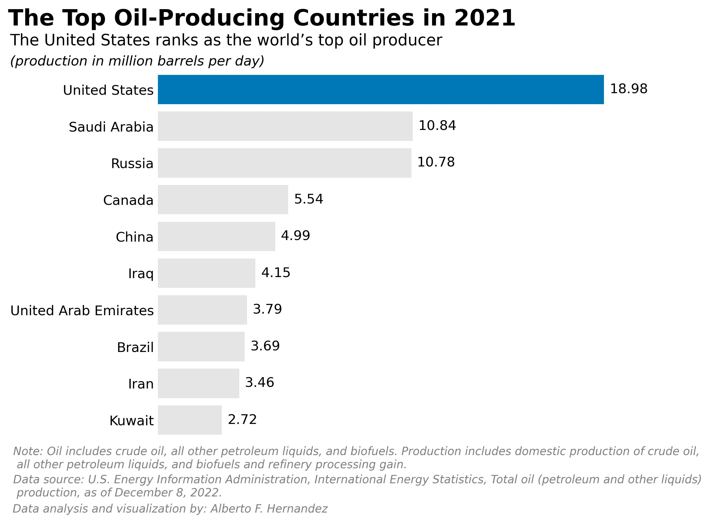

# Top Oil-Producing Countries Analysis

This repository contains files related to an analysis of the top oil-producing countries as of 2021. The analysis is based on the data provided in the CSV files, and the results are presented in the Jupyter Notebook file.

## Repository Contents

### CSV Files

1. `INT-Export-03-06-2023_12-08-31.csv`: The original dataset containing the oil-production data for the analysis.
2. `Top_10_Oil_Producer_13_03_2022.csv`: The cleaned and processed dataset containing the top 10 oil-producing countries with their respective production volumes and rankings.
3. `Top_10_oil_producer_as_december08_2022.csv`: An alternative version of the dataset, containing the top 10 oil-producing countries as of December 8, 2022.

### Jupyter Notebook

`Top_Oil_Producing_Countries_2021.ipynb`: The Jupyter Notebook containing the Python code used to perform the data cleaning, processing, and analysis of the top oil-producing countries.

### Image

`my_plot_v3.jpg`: A graphical representation of the top 10 oil-producing countries based on the analysis conducted in the Jupyter Notebook.

### README

`README.md`: This file provides an overview of the repository contents and the analysis performed.

## How to Use

1. Clone or download this repository to your local machine.
2. Make sure you have Python and Jupyter Notebook installed.
3. Open the Jupyter Notebook `Top_Oil_Producing_Countries_2021.ipynb` in your preferred environment (e.g., JupyterLab, VSCode, or the Jupyter Notebook App) to view the code and its documentation.
4. Run the cells in the notebook to reproduce the analysis or modify the code as needed to perform your own analysis.

## Authorship

This analysis and the accompanying files were created by Alberto F. Hernandez. If you have any questions, suggestions, or issues, please feel free to contact me at ah8664383@gmail.com.

## References

Harris, C., Millman, K., van der Walt, S., Gommers, R., Virtanen, P., & Cournapeau, D. et al. (2022). Array programming with NumPy. Springer Science and Business Media LLC.

Hunter, J. (2007). Matplotlib: A 2D graphics environment. IEEE COMPUTER SOC.

Kluyver, T., Ragan-Kelley, B., Perez, F., Granger, B., Bussonnier, M., & Frederic, J. et al. (2016). Jupyter Notebooks - a publishing format for reproducible computational workflows. In Positioning and Power in Academic Publishing: Players, Agents and Agendas (pp. 87-90). Netherlands; IOS Press. Retrieved 19 May 2022, from https://eprints.soton.ac.uk/403913/.

The pandas development team. (2020). pandas-dev/pandas: Pandas. Zenodo.

U.S. Energy Information Administration. (n.d.). Petroleum and other liquids. Retrieved March 6, 2023, from https://www.eia.gov/international/data/world/petroleum-and-other-liquids/annual-refined-petroleum-products-consumption?pd=5&amp;p=0000000000000000000000000000000000g&amp;u=0&amp;f=A&amp;v=mapbubble&amp;a=-&amp;i=none&amp;vo=value&amp;t=C&amp;g=00000000000000000000000000000000000000000000000001&amp;l=249-ruvvvvvfvtvnvv1urvvvvfvvvvvvfvvvou20evvvvvvvvvnvvvvs&amp;s=94694400000&amp;e=1609459200000&

van Rossum, G. (1991). Python. Python Software Foundation.

